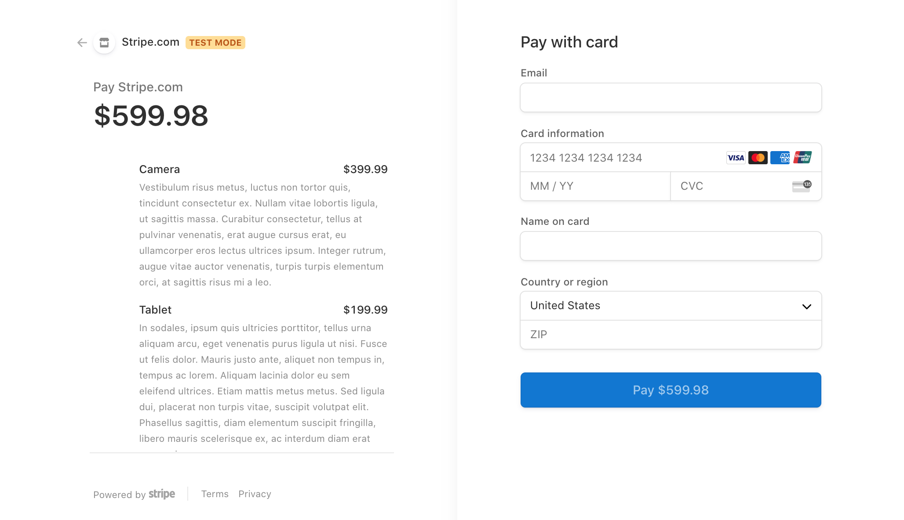

## Shop Shop - MERN Stack

### Application Screenshot




### App Deployment

https://shoshop555-4f44574aa54f.herokuapp.com/


### Deplyment Instructions

npm i


Example: 

mongodb+srv://shopshopuser:P@ssword123@cluster0.twmms.mongodb.net/shop_shop_db?retryWrites=true&w=majority
```

### User Story

```text
AS a senior engineer working on an e-commerce platform
I WANT my platform to use Redux to manage global state instead of the Context API
SO THAT my website's state management is taken out of the React ecosystem
```

### Acceptance Criteria

```text
GIVEN an e-commerce platform that uses Redux to manage global state
WHEN I review the app’s store
THEN I find that the app uses a Redux store instead of the Context API
WHEN I review the way the React front end accesses the store
THEN I find that the app uses a Redux provider
WHEN I review the way the app determines changes to its global state
THEN I find that the app passes reducers to a Redux store instead of using the Context API
WHEN I review the way the app extracts state data from the store
THEN I find that the app uses Redux instead of the Context API
WHEN I review the way the app dispatches actions
THEN I find that the app uses Redux instead of the Context API
```

### Instructions

```text
cd MongoData/ from root directory
mongod --dbpath=/Users/Priya/MongoData

npm run start
```
